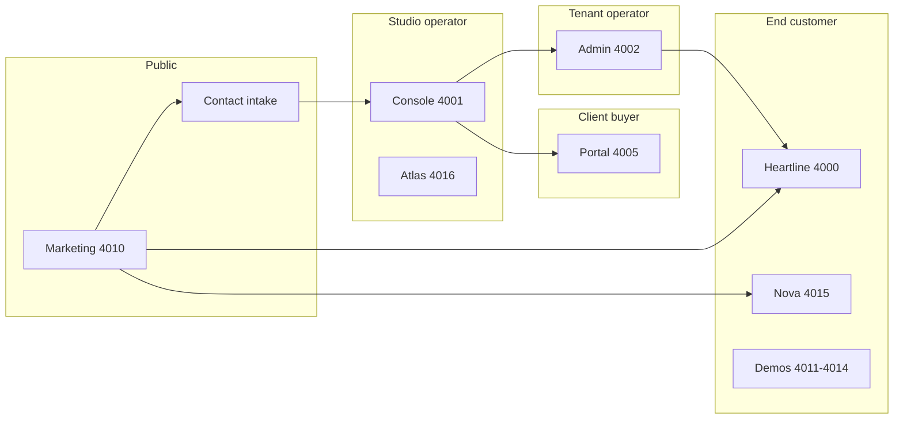

# Full platform surface readiness audit

**Date:** 2026-05-26  
**Scope:** Every routed page/screen in the monorepo (web + mobile), assessed by purpose, navigation, tone, and merge potential.  
**Ports:** Local dev uses **4000–4016** (see `docs/setup/local-dev.md`).

---

## Executive answers (ultimate questions)

| Question | Verdict | Notes |
|----------|---------|--------|
| Have we worn all required hats? | **Mostly for v1 studio + Tier 1 demos** | Strong on operator, prospect, client-portal, and Heartline customer. Weaker on production ops, legal/compliance sign-off, native mobile buyer, and “reference blueprint” depth (Bazaar/Signal/Lumen are thin demos). |
| Is the **company** (studio) fully ready? | **No — ~75%** | Can sell and deliver in mock/local with discipline. Production deploy, Stripe live, factory certs, and operator sign-off still open (`docs/platform/studio-remaining-work.md`). |
| Is the **marketing website** fully ready? | **Content ~85%, launch ~60%** | Narrative, legal framing, and route set are strong. Needs prod host, capacity truth, end-to-end lead→desk proof on production, and checklist pass (`docs/marketing/marketing-site-review.md`). |
| Is the **product** fully ready? | **Tier 1 demos yes; “factory at scale” no** | Heartline + Nova + Studio OS + portal are deep. Secondary blueprints are showroom shells. Deal desk is powerful but dense for new operators. |

**Honest one-liner:** The platform is an excellent **demo factory and delivery cockpit** for a boutique studio; it is **not** yet a fully production-proven, self-serve company without the Wave 0 operator checklist.

---

## Personas (“hats”) vs surfaces

| Hat | Primary surfaces | Ready for real work? |
|-----|------------------|----------------------|
| Prospect / inbound lead | Marketing, contact | Yes (with prod + spam/rate limits verified) |
| Studio owner / staff | Console desk, enquiries, deals, factory, settings | Yes locally; prod + cron alerts pending |
| Client (deal signer) | Client portal `/deal/[id]?token` | Yes for sample + scoped deals |
| Tenant owner (e.g. Alex) | Admin dashboard, flags, users | Yes; confusing vs Console login until explained |
| End customer (dating) | Heartline web + mobile | Web strong; mobile separate / optional |
| End customer (booking) | Nova Care | Good golden path; thinner than Heartline |
| Reference blueprint shopper | Bazaar, Signal, Lumen, Acme | Intentionally shallow — label as demos |
| Internal knowledge | Atlas | Works; index + role scope need ops habit |

---

## Full route inventory (~90 web pages)

### Marketing — `goldspire-web` (4010)

| Route | Keep? | Purpose | UX / tone |
|-------|-------|---------|-----------|
| `/` | Yes | Positioning + dual CTA | Strong; premium, clear. Hero avoids €. |
| `/templates` | Yes | Catalog scan | Good; tie to live demos on 4000-range. |
| `/templates/[id]` | Yes | Template detail + demo CTA | Good; ensure demo links use env. |
| `/pricing` | Yes | Tier orientation | Good; “not binding” visible. |
| `/how-we-work` | Yes | Trust + glossary | Strong after jump links. |
| `/contact` | Yes | Lead capture | Good form + prefills; verify success panel SLA copy. |
| `/case-studies` | Yes | Reference builds without logos | Good framing; could add 1–2 more outcome bullets. |
| `/privacy`, `/terms` | Yes | Legal | Required; keep readable. |
| `/status` | Yes (footer only) | Diagnostics | Correctly not in primary nav. |

**Merge ideas:** None critical — route split matches buyer journey.

---

### Studio Console — `console` (4001)

| Route | Keep? | Purpose | UX / tone |
|-------|-------|---------|-----------|
| `/login` | Yes | Persona picker | Clear for dev; replace for prod auth. |
| `/` (Desk) | Yes | Daily home — queue + KPIs | Strong; human greeting; clear next actions. |
| `/leads` | Yes | Enquiries pipeline | Core; name “Enquiries” matches rail. |
| `/deals`, `/deals/new`, `/deals/[id]` | Yes | Deal desk + cockpit | **Dense** on `[id]` — power users OK, onboarding heavy. |
| `/factory` | Yes | Clone factory | Core Tier 1 story. |
| `/tenants`, `/tenants/[id]/capabilities` | Yes | Portfolio + capability gates | Good; capabilities page is advanced. |
| `/reports` | Yes | Revenue & ops charts | Absorbed `/analytics` redirect — good. |
| `/settings` | Yes | Studio profile, capacity, webhooks | Long but justified. |
| `/onboard` | Yes | Stamp tenant wizard | Critical path; keep linked from deals. |
| `/commercial` | Yes | Commercial hub | Overlaps templates/pricing mentally — OK in “More”. |
| `/catalog/templates`, `/catalog/offerings`, `/catalog/feature-flags` | Yes | Catalog ops | Offerings + templates could confuse — consider one “Catalog” hub with tabs only (templates page may already tab). |
| `/blueprints` | Yes | Blueprint reference | Sales/engineering; stays in More. |
| `/delivery`, `/playbooks` | Yes | Runbooks | Docs-like; correct in More. |
| `/apps` | Yes | Deploy launcher | **Watch DB `localDevUrl`** after port change — re-seed. |
| `/lab`, `/lab/compare` | Yes | Owner portfolio | Niche; correctly not on primary rail. |
| `/docs`, `/docs/view` | Yes | In-app documentation | Excellent for operators. |
| `/audit` | Yes | Audit log | System; fine in More. |
| `/plans` | Redirect | → catalog pricing | Good merge. |
| `/analytics` | Redirect | → reports | Good merge. |
| `/portal/deal/[id]` | Yes (legacy) | Redirect to client portal | Keep for bookmarks. |

**Nav assessment:** Primary rail (Enquiries → Deals → Factory → Tenants → Reports → Settings) matches daily work. “More” holds reference/system — acceptable if Cmd+K is trained.

**Tone:** Operator-professional; mostly human. Watch jargon on deal cockpit modules — surface guide helps.

---

### Admin — `admin` (4002)

| Route | Keep? | Purpose | UX / tone |
|-------|-------|---------|-----------|
| `/login` | Yes | Tenant personas | **Confusion:** multiple client owners on one picker — product choice, not bug. |
| `/select-tenant` | Yes | Studio operator tenant pick | Needed for cross-tenant admin. |
| `/dashboard` | Yes | Tenant home | Clear metrics + quick links. |
| `/users`, `/products`, `/subscriptions` | Yes | Tenant ops | Standard B2B admin set. |
| `/feature-flags` | Yes | Tenant flags | Demo tour anchor. |
| `/moderation`, `/messages`, `/notifications` | Yes | Ops | Moderation matters for dating demo. |
| `/analytics`, `/reports` | Yes | Tenant insights | Two report surfaces — consider merge later like Console. |
| `/audit` | Yes | Tenant audit | Parallels Console audit — OK. |
| `/settings` | Yes | Tenant + link to Console | Good bridge to studio. |

**Merge ideas:** `analytics` + `reports` → single “Insights” when time allows.

---

### Client portal — `client-portal` (4005)

| Route | Keep? | Purpose | UX / tone |
|-------|-------|---------|-----------|
| `/` | Yes | Explains token-only access | Human, reassuring — excellent. |
| `/deal/[id]` | Yes | Accept, pay, intake, pulse | Core client experience; long but purposeful. |

**No merge needed.**

---

### Heartline — `dating-web` (4000)

| Route | Keep? | Purpose | UX / tone |
|-------|-------|---------|-----------|
| `/login` | Yes | Customer personas | Dev-only pattern. |
| `/`, `/onboarding` | Yes | Entry + setup | Onboarding supports demo narrative. |
| `/discover`, `/likes`, `/matches` | Yes | Core loop | Showcase-quality. |
| `/messages`, `/messages/[threadId]` | Yes | Chat | Core. |
| `/profile`, `/verify`, `/safety` | Yes | Trust + profile | Good for sales story. |
| `/premium`, `/growth/*` | Yes | Monetization + growth | Supports Plus/Premium demo. |

**Product-ready for Tier 1 dating factory** subject to factory cert checklist.

---

### Heartline mobile — `dating-mobile`

| Screen | Keep? | Notes |
|--------|-------|-------|
| login, onboarding, tabs (discover, likes, matches, messages, profile, premium) | Yes | Parity with web; run via `pnpm dev:mobile`; API → 4000. |

**Not blocking web studio sale.**

---

### Nova Care — `booking-web` (4015)

| Route | Keep? | Purpose |
|-------|-------|---------|
| `/`, `/services`, `/book`, `/bookings` | Yes | Booking golden path |

**Good reference; less depth than Heartline — acceptable for Tier 1 booking cert.**

---

### Reference demos — marketplace, community, ai-agent, b2b (4011–4014)

| App | Routes | Verdict |
|-----|--------|---------|
| Bazaar | `/`, shop, sell, orders | **Showroom** — enough to prove marketplace blueprint. |
| Signal | `/`, spaces, feed | **Thin** — feed/spaces need “sample content” banners. |
| Lumen | `/`, chat, tasks | **Thin** — chat OK; tasks often empty. |
| Acme | `/`, dashboard, team, billing | **Medium** — good B2B shell story. |

**Do not merge into one app** — separate ports sell separate templates. Do add consistent “Goldspire reference demo” banner on each.

---

### Atlas — `atlas` (4016)

| Route | Keep? | Purpose |
|-------|-------|---------|
| `/` | Yes | RAG Q&A over studio docs |

**Excellent internal hat; not client-facing.**

---

## Cross-cutting issues (navigation & redirects)

1. **Env-driven URLs** — Persona redirects use `NEXT_PUBLIC_*_URL`. Stale `.env` caused 3002 redirects; fixed. Re-seed DB for Apps grid URLs.
2. **Two login pages** — Console (studio) vs Admin (tenant owners) vs Heartline (customers). Document one line: “Studio → 4001; client ops → 4002; end users → 4000.”
3. **Email domains** — Portal mentions `support@goldspire.studio`; marketing uses `hello@goldspire.dev` — align or explain.
4. **Launch checklist ports** — Update `launch-readiness-checklist.md` to 4000-range (still shows 3000s).
5. **Docs vs product** — Many routes duplicate content in `/docs` and `/delivery` — intentional (operators read in-app).

---

## What serves its purpose excellently

- Marketing narrative (`marketing-site-narrative.ts`) — tone, qualifications, glossary.
- Console Desk + enquiries → deals thread.
- Client portal root + deal experience.
- Heartline discover/match/message loop.
- Console redirects merging plans/analytics.
- Persona picker bios — human and clear.

---

## What is off or weak (user POV)

| Issue | Severity | Suggestion |
|-------|----------|------------|
| Deal detail page cognitive load | Medium | Progressive disclosure / “guided mode” for new operators |
| Admin login shows 4+ owners | Medium | Group by tenant or “pick tenant first” |
| Thin blueprint demos | Low (if labeled) | Global demo disclaimer component |
| Console “More” menu size | Low | Already mitigated by rail + Cmd+K |
| Production auth still mock | High for launch | Supabase/Clerk path |
| Factory certs unsigned | High for marketing claims | Run checklists |
| Mobile Expo stability | Medium | Keep out of default `pnpm dev` |

---

## Recommended verification pass (you, ~2 hours)

1. `pnpm probe:dev-urls` on 4000-range.
2. Marketing: full click `/` → contact → success; templates → live demo.
3. Console: studio.owner — desk → lead → deal → portal link → onboard.
4. Admin: heartline.owner — dashboard → feature flags.
5. Portal: sample deal token from seed.
6. Heartline: customer persona discover → match → message.
7. Nova: book flow once.

---

## Prioritized backlog (product/UX only)

**P0 — Before saying “fully ready”**

- [ ] Production deploy + env on real hosts
- [ ] `pnpm db:seed` after port migration (Apps grid URLs)
- [ ] Stripe live + portal pay path on prod
- [ ] Replace mock auth story for public launch
- [ ] Update launch checklist + TESTING.md ports to 4000-range

**P1 — UX polish**

- [ ] Admin login: tenant-grouped personas
- [ ] Deal cockpit: collapsible sections / first-run tips
- [ ] Demo apps: shared “reference build” banner
- [ ] Align support/contact emails in portal vs marketing

**P2 — Consolidation (optional)**

- [ ] Admin analytics + reports merge
- [ ] Console catalog single hub (templates + offerings + pricing tabs only)

---

## Related docs

- `docs/marketing/marketing-site-review.md`
- `docs/marketing/start-a-project-product-design.md`
- `docs/platform/studio-remaining-work.md`
- `docs/deployment/launch-readiness-checklist.md`
- `DEMO.md`
