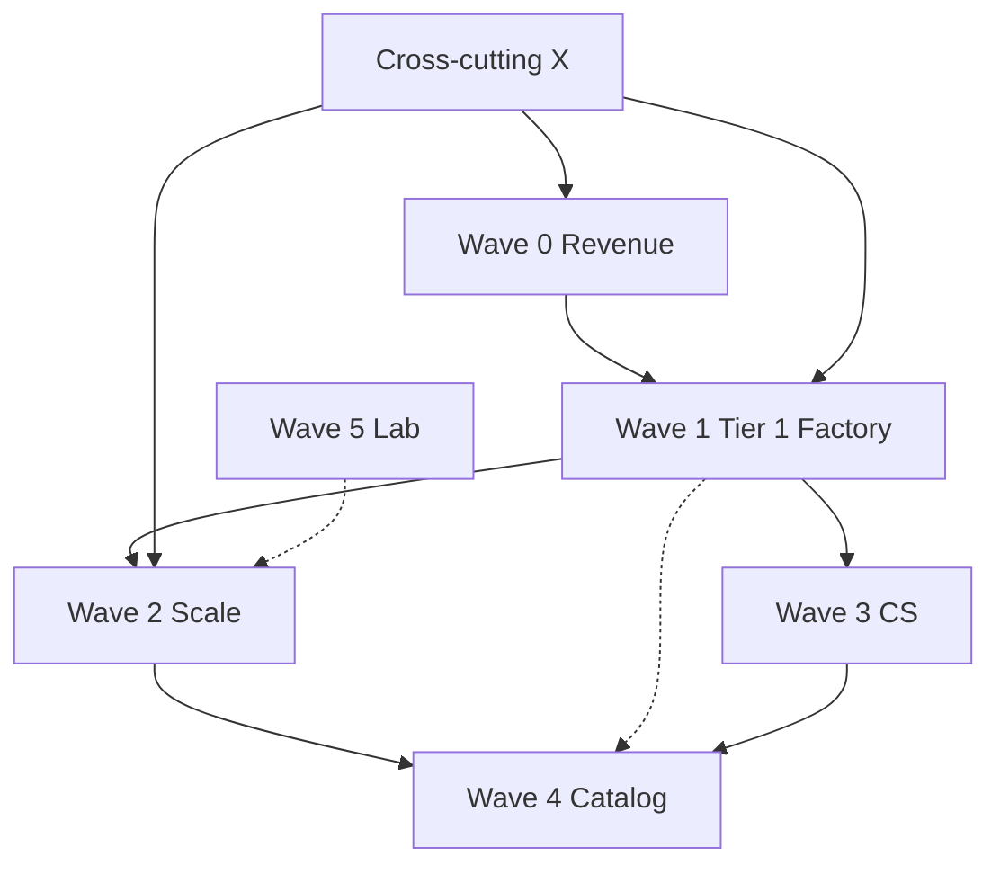

# Goldspire Studio — comprehensive build plan

**Status:** Master execution plan (depth × breadth × width).  
**Companion:** [executive-operating-model.md](./executive-operating-model.md) (per-role mandates and audits).  
**Operator narrative:** [../studio/internal-delivery-lifecycle.md](../studio/internal-delivery-lifecycle.md).

**Last updated:** 2026-05-26.

---

## Executive summary

Goldspire is ready to **sell** when Wave 0 (production revenue path) and Wave 1 (Tier 1 factory certification for dating + booking) are complete. Waves 2–4 add **capacity, CS, and expansion** without blocking first revenue. Wave 5 is optional founder/Lab depth.

**Do not start Wave 2 until Wave 0 acceptance criteria are green on staging and production.**

Off-platform / manual work is **only** in [Appendix A](#appendix-a--off-platform--manual-owner-checklist) at the end of this document.

**Operator “am I ready?”** → [launch-readiness-checklist.md](../deployment/launch-readiness-checklist.md) (code-only gates).  
**Open backlog** → [studio-remaining-work.md](./studio-remaining-work.md).

### North star (board outcome)

Goldspire’s near-term north star is **not “build anything fast.”** It is:

- **Sell and deliver Tier 1 clones repeatedly** (dating + booking) at fixed price with scope discipline
- Operate every deal through **Studio OS** (Console + portal + runbooks) so delivery is reliable without founder heroics
- End engagements at the named finish line (**Launch ready**) and move post-launch work into retainer/change-orders

### Mobile stance (Tier 1)

Most buyers want “an app,” but not every service needs native. The operating stance:

- **Default Tier 1 promise = web launch** (fast, margin-safe, shippable)
- **Native is a premium SKU** where it changes user behaviour materially (dating is the canonical case)
- **Mobile is not blocking Wave 0 sellability**; it becomes blocking only if you choose to publicly promise “web + native by default”

---

## Planning dimensions (depth · breadth · width)

| Dimension | Meaning | This plan |
|-----------|---------|-----------|
| **Breadth** | Every surface and package touched | [Surface matrix](#surface-matrix-full-audit) |
| **Depth** | How far each domain goes (API → UI → ops → docs) | Per-epic deliverables + acceptance |
| **Width** | Cross-cutting layers (commercial, security, CI, docs) | [Cross-cutting track](#cross-cutting-track-x) |

### Wave map

```text
Wave 0 ─ Revenue hardening (prod path)          ████ BLOCKING
Wave 1 ─ Tier 1 factory (dating + booking)      ████ BLOCKING for scale
Wave 2 ─ Studio OS scale (v3)                   ███░
Wave 3 ─ Client success & retainers (v4)        ██░░
Wave 4 ─ Controlled catalog expansion           █░░░
Wave 5 ─ Lab / founder optional                 ░░░░
Cross-cutting X ─ Security, CI, docs            ════ every release
```

---

## Surface matrix (full audit)

### Apps (`apps/`)

| App | Port | Role | Wave | Notes |
|-----|------|------|------|-------|
| `console` | 4001 | Studio OS | 0–3 | Money path, Desk, factory |
| `goldspire-web` | 4010 | Marketing | 0, 2 | Capacity flags, discovery CTA |
| `client-portal` | 4005 | Client delivery | 0, 3 | Milestone UX, CS fields |
| `admin` | 4002 | Tenant ops | 1 | Per clone handover |
| `dating-web` | 4000 | Tier 1 reference | 1 | Flagship clone |
| `booking-web` | 4015 | Tier 1 reference | 1 | Second clone parity |
| `dating-mobile` | Expo | SKU add-on | 1 | Companion/native arms only |
| `atlas` | 4016 | Knowledge | 5 | Venture corpus |
| `marketplace-web` | 4011 | Catalog demo | 4 | Reference demo banner |
| `community-web` | 4012 | Catalog demo | 4 | Reference demo banner |
| `ai-agent-web` | 4013 | Catalog demo | 4 | Reference demo banner |
| `b2b-saas-web` | 4014 | Catalog demo | 4 | Reference demo banner |

### Packages (width)

| Package | Waves | Critical paths |
|---------|-------|----------------|
| `@goldspire/commercial` | 0–4 | Pricing, runbooks, portal UI rules, SKUs |
| `@goldspire/api` | 0–3 | marketing, studio, studio-deals, portal-deals |
| `@goldspire/db` | 0–3 | Migrations, RLS, studio deal tables |
| `@goldspire/payments` | 0, 3 | Stripe webhooks, deal lifecycle |
| `@goldspire/blueprints` | 1, 4 | Template status, golden paths |
| `@goldspire/platform` | 0, 2 | Cache, rate limits, Inngest |
| `@goldspire/cli` | 1 | `goldspire new` scaffold |
| `@goldspire/feature-flags` | 1 | Public flag catalog |
| `@goldspire/audit` | X | All mutations |
| Others | 1+ | As needed per template |

### Blueprint / template maturity

| Template ID | Status | Fixed-price | Wave |
|-------------|--------|-------------|------|
| `social_matching/dating` | shipped | ✅ | 1 certify |
| `multi_staff_booking/clinic` | shipped | ✅ after parity | 1 |
| `marketplace/local_listings` | beta | ❌ demo | 4 |
| `community/membership_hub` | beta | ❌ demo | 4 |
| `vertical_ai_agent/studio_assistant` | beta | ❌ demo | 4 |
| `b2b_saas/control_plane` | beta | ❌ demo | 4 |
| `social_matching/mentorship` | planned | ❌ | 4+ |

### Automation & CI (inventory)

| Command / workflow | Purpose | Wave |
|--------------------|---------|------|
| `pnpm verify:local` | Tier 1 gate | X |
| `pnpm certify:v1` | v1 bundle | 0 |
| `pnpm smoke:golden-paths` | HTTP smoke | 0, 1 |
| `pnpm audit:studio-business` | SLA + template rules | X |
| `pnpm audit:commercial-sync` | Pricing drift | X |
| `pnpm test:e2e --project=studio-os` | Console flows | 0–2 |
| `pnpm test:e2e --project=marketing` | Contact | 0 |
| `pnpm test:e2e --project=integration` | Lead → deal | 0 |
| `.github/workflows/studio-ops-cron.yml` | Runbook + stale leads | 0 |
| `pnpm studio:runbook-alerts` | Manual cron fallback | 0 |
| `pnpm studio:lab-cron` | Lab probes | 5 |

---

## Wave 0 — Revenue hardening (BLOCKING)

**Goal:** Real money path on production: contact → enquiry → convert → portal accept → Stripe milestone → ops notified.

**Owner hats:** CEO (go/no-go), COO (runbook), CTO (infra), CPO (portal).

### Epic 0.1 — Production deploy matrix

| # | Task | Acceptance | Touchpoints |
|---|------|------------|-------------|
| 0.1.1 | Deploy marketing, console, client-portal, dating-web | All `/api/health` 200 | `docs/deployment/vercel.md`, env per app |
| 0.1.2 | Set production env on each host | `NODE_ENV=production pnpm verify:prod-env` passes | `.env.example` |
| 0.1.3 | Configure `DATABASE_URL_APP` + RLS role | `docs/deployment/database-app-role.md` | `packages/db/policies/` |
| 0.1.4 | Upstash for rate limits | Contact spam test from two instances | `@goldspire/platform` cache |
| 0.1.5 | Disable `STUDIO_DEAL_DEV_RESET_ENABLED` in prod | Env audit | config |

### Epic 0.2 — Stripe live path

| # | Task | Acceptance | Touchpoints |
|---|------|------------|-------------|
| 0.2.1 | Stripe webhook on Console | Test event settles line | `apps/console/.../webhooks/stripe/route.ts` |
| 0.2.2 | Portal `confirmStripeReturn` on staging | E2E or manual once | `client-portal` |
| 0.2.3 | Live keys on staging first, then prod | Milestone marked paid in DB | `packages/payments/` |
| 0.2.4 | Ops email on pay + accept | Inbox received | `studio-deal-notify` |

### Epic 0.3 — Operator readiness

| # | Task | Acceptance | Touchpoints |
|---|------|------------|-------------|
| 0.3.1 | Console Settings: primary email + Desk webhook | Test 48h scan on `/delivery` | `settings/page.tsx` |
| 0.3.2 | Wire `studio-ops-cron` in GitHub (or Inngest) | Runbook + stale digest received | `.github/workflows/studio-ops-cron.yml` |
| 0.3.3 | `pnpm certify:v1` on staging stack | `certify-v1.result.json` success | `V1_CERTIFICATION.md` |
| 0.3.4 | Complete operator sign-off tier 5 | All boxes in sign-off doc | `operator-sign-off.md` |

### Epic 0.4 — Commercial drift prevention

| # | Task | Acceptance | Touchpoints |
|---|------|------------|-------------|
| 0.4.1 | CI runs `audit:commercial-sync` | Green on main | `.github/workflows/ci.yml` |
| 0.4.2 | Marketing demo URLs match deployed hosts | Click-through from `/` and `/templates` | `catalog-demo-urls.ts` |

**Wave 0 exit criteria**

- [ ] Live contact creates lead visible in Console within 1 min
- [ ] Convert → fresh portal token → accept → test payment → milestone settled
- [ ] Desk shows updated collected/outstanding
- [ ] No production env uses mock payment provider
- [ ] Sign-off + phase-0 checklists complete

---

## Wave 1 — Tier 1 factory excellence (BLOCKING for scale)

**Goal:** Dating and booking clones are **factory-certified**: same operational bar for sales, delivery, smoke, e2e, handover.

**Owner hats:** COO (runbook), CTO (scaffold), CPO (catalog truth), VP CS (handover).

### Epic 1.1 — Dating (Heartline) certification

| # | Task | Acceptance | Touchpoints |
|---|------|------------|-------------|
| 1.1.1 | Golden path smoke green | `pnpm smoke:golden-paths` dating routes | `golden-paths.ts` |
| 1.1.2 | E2E: discover → match → paywall path | `test:e2e` dating/console specs | `e2e/tests/` |
| 1.1.3 | All 4 dating SKUs have deal presets | Factory shows each preset | `dating-delivery-skus.ts`, `deal-presets.ts` |
| 1.1.4 | Clone runbook dry-run on sample deal | 14 steps completable; 48h alert fires | `clone-runbook.ts` |
| 1.1.5 | Identity + configuration passes documented | Console toggles match docs | `identity-pass.md`, `configuration-pass.md` |
| 1.1.6 | Handover checklist on sample deal | All `handover-checklist.ts` ids | Console Handover tab |
| 1.1.7 | `goldspire new` for dating blueprint | New folder runs `pnpm dev` | `@goldspire/cli` |
| 1.1.8 | Feature-flag public loop verified | Tour 4 in `DEMO.md` | `use-flag.ts`, catalog features |
| 1.1.9 | Moderation path demo-ready | `fixup:moderation-demo` documented | `admin/moderation` |

**Dating certification artifact:** Add `docs/studio/tier1-dating-factory-certification.md` (checklist copy from this epic) when complete.

### Epic 1.2 — Booking (Nova Care) parity

| # | Task | Acceptance | Touchpoints |
|---|------|------------|-------------|
| 1.2.1 | Golden path smoke green | `/`, `/services`, `/book` | `booking-web` |
| 1.2.2 | E2E coverage ≥ dating depth | New or extended `e2e` spec | `e2e/tests/` |
| 1.2.3 | Tier 1 booking preset + economics | Matches `pricing-constants` floor | `deal-presets.ts` |
| 1.2.4 | Factory runbook for booking preset | Steps parallel dating | `clone-runbook.ts` or preset-specific |
| 1.2.5 | TESTING.md Part for Nova Care | Ordered QA steps | `TESTING.md` |
| 1.2.6 | Marketing lists booking as **shipped** clone only | `/pricing` bullets accurate | `marketing-offerings.ts` |
| 1.2.7 | Stamp + scaffold booking tenant | `nova-care` pattern reproducible | `provision-pass.md` |

**Wave 1 exit criteria**

- [ ] Both `tier1_clone` golden paths certified in writing
- [ ] CEO LOCK: public fixed-price promises only for these two
- [ ] Delivery lead runbook: one full dating + one booking dry-run logged

### Epic 1.3 — Mobile SKUs (line-item, not default clone)

| # | Task | Acceptance | Touchpoints |
|---|------|------------|-------------|
| 1.3.1 | Companion + native arms in calculator | Quote matches `dating-delivery-skus` | `catalog.ts`, Console `/plans` |
| 1.3.2 | Expo app shares tRPC with web | `fixup:heartline-walkthrough` in TESTING | `dating-mobile` |
| 1.3.3 | Store submission add-on documented | €4k indicative in proposals | `template-scope-and-tiers.md` |
| 1.3.4 | Dev stack can run without mobile | `pnpm dev` (or E2E servers) do not fail if Expo watcher is off | turbo config / docs |
| 1.3.5 | Mobile toolchain stability note | Clear “supported Node/Expo” guidance for operators | `TESTING.md` or `docs/deployment/` |

---

## Wave 2 — Studio OS scale (v3)

**Goal:** Operate **15 → 40** clients without list UX collapse, manual stamp tax, or overselling capacity.

**Maps to:** [studio-platform-roadmap.md](./studio-platform-roadmap.md) v3.

### Epic 2.1 — Pagination & performance

| # | Task | Acceptance | Touchpoints |
|---|------|------------|-------------|
| 2.1.1 | Paginated deal board | 100+ deals load <2s perceived | `deals/page.tsx`, API cursor |
| 2.1.2 | Virtualised lead list | 500+ leads scroll smoothly | `leads/page.tsx` |
| 2.1.3 | Composite indexes reviewed | Explain plans for lead/deal queries | `packages/db/drizzle/` |

### Epic 2.2 — Auto tenant stamp on first payment

| # | Task | Acceptance | Touchpoints |
|---|------|------------|-------------|
| 2.2.1 | On milestone settle, if deal has preset with template | Create stamp job or deep-link with prefill | `studio-deal-payment-sync`, `payments/` |
| 2.2.2 | Audit event `tenant_stamp_scheduled` | Visible in deal timeline | audit |
| 2.2.3 | Operator can override/skip | Settings or deal flag | commercial rules |
| 2.2.4 | E2E: pay → onboard link or auto tenant | integration project | `e2e/` |

### Epic 2.3 — Discovery sprint SKU

| # | Task | Acceptance | Touchpoints |
|---|------|------------|-------------|
| 2.3.1 | `contact?sprint=1` or `intent=discovery` | Creates lead tag | `goldspire-web/contact` |
| 2.3.2 | Factory preset `discovery-sprint` | Fixed fee band, short milestones | `deal-presets.ts`, `STUDIO_REVENUE_SKUS_V0` |
| 2.3.3 | Convert preview shows sprint economics | Enquiry drawer | `marketing.ts` |
| 2.3.4 | Playbook link in Console | Enquiry SLA + sprint SOW snippet | `studio-playbooks.ts` |

### Epic 2.4 — Template capacity flags

| # | Task | Acceptance | Touchpoints |
|---|------|------------|-------------|
| 2.4.1 | DB field or studio profile JSON: `acceptingClones: Record<templateId, boolean>` | — | schema migration |
| 2.4.2 | Console Catalog → toggle per shipped template | Saves to profile | `catalog/templates` |
| 2.4.3 | Marketing API reads flags | “Join waitlist” or hide CTA when closed | `marketing.ts`, `goldspire-web` |
| 2.4.4 | Desk warning if lead wants closed template | Action queue item | `deskPulse` |

### Epic 2.5 — Account manager view (light)

| # | Task | Acceptance | Touchpoints |
|---|------|------------|-------------|
| 2.5.1 | Deal health score (rules-based) | 0–100 from runbook + payments + stale | `studio-deals` router |
| 2.5.2 | `/deals/[id]` shows score + reasons | Operator sees top 3 blockers | deal cockpit |
| 2.5.3 | CSV export for QBR | Download from deal or reports | optional |

### Epic 2.6 — Multi-studio tenant (defer if not needed)

| # | Task | Acceptance | Touchpoints |
|---|------|------------|-------------|
| 2.6.1 | Replace hardcoded `goldspire` slug | Config-driven studio tenant | `packages/access`, seeds |

**Wave 2 exit criteria**

- [ ] 50-deal seed performance acceptable
- [ ] First paid milestone triggers stamp workflow in E2E
- [ ] Discovery sprint sellable end-to-end in Console
- [ ] At least one template capacity flag visible on marketing

---

## Wave 3 — Client success & expansion (v4)

**Goal:** Recurring revenue and expansion without custom CRM.

### Epic 3.1 — Retainer in deal desk

| # | Task | Acceptance | Touchpoints |
|---|------|------------|-------------|
| 3.1.1 | Deal type `retainer` or line kind `recurring` | — | schema, `studio-commercial` |
| 3.1.2 | Preset from `maintenance-retainer.md` tiers | Standard / Plus / Concierge | `deal-presets.ts` |
| 3.1.3 | Renewal date + Desk alert 30d before | Action queue | `deskPulse` |
| 3.1.4 | Portal tab “Support plan” (read-only scope) | Client sees SLA summary | `portal-client-ui.ts`, portal UI |

### Epic 3.2 — Portal CS enhancements

| # | Task | Acceptance | Touchpoints |
|---|------|------------|-------------|
| 3.2.1 | `nextDemoAt` + `nextDemoUrl` on deal | Portal Pulse shows date + link | schema, portal-deck |
| 3.2.2 | Operator edits from deal cockpit | Saves + audit | Console deal UI |
| 3.2.3 | Timeline row type `demo_scheduled` | Appears in portal history | deal activity |

### Epic 3.3 — Upsell triggers

| # | Task | Acceptance | Touchpoints |
|---|------|------------|-------------|
| 3.3.1 | Rules: tenant MRR > X, no mobile SKU | Desk “expansion opportunity” | `studio-desk-pulse.ts` |
| 3.3.2 | Link to calculator with add-ons pre-selected | Opens `/plans` or deal quote | Console |

### Epic 3.4 — Self-serve client status (optional)

| # | Task | Acceptance | Touchpoints |
|---|------|------------|-------------|
| 3.4.1 | Public status per tenant (studio clients only) | Uptime + last deploy | new route or `goldspire-web/status` extension |

**Wave 3 exit criteria**

- [ ] One retainer deal created and renewed in test
- [ ] Portal shows next demo for active deal
- [ ] Desk shows at least one expansion opportunity from seed rules

---

## Wave 4 — Controlled catalog expansion

**Goal:** Grow moat without breaking fixed-price discipline.

### Epic 4.1 — Beta → shipped promotion process

| # | Task | Acceptance | Touchpoints |
|---|------|------------|-------------|
| 4.1.1 | Written promotion checklist | Doc in `docs/studio/` | new `template-promotion-checklist.md` |
| 4.1.2 | Requires Wave 1-style certification | Sign-off before `status: 'shipped'` | `templates/types.ts` |
| 4.1.3 | Marketing + API auto-update | `templateById` live | blueprints |

### Epic 4.2 — Next template candidates (priority order)

| Candidate | Prerequisite | Wave |
|-----------|--------------|------|
| Marketplace local listings | E2E + runbook + preset | 4.2 |
| Community hub | Cold-start playbook in template notes | 4.2 |
| B2B SaaS shell | Tenant billing story | 4.2 |
| AI studio assistant | Model vendor DPA | 4.2 |
| Mentorship (planned) | New category spec | 4.3+ |

### Epic 4.3 — Tier 2 / Tier 3 factory

| # | Task | Acceptance | Touchpoints |
|---|------|------------|-------------|
| 4.3.1 | Tier 2 runbook in Console factory | Extra “template spec” step enforced | `tier2-template-runbook.md` |
| 4.3.2 | Tier 3 architecture sign-off gate | Deal cannot enter build without checklist | `tier3-blueprint-runbook.md` |
| 4.3.3 | €85k+ filter on contact form | Already partially via budget bands | marketing |

**Wave 4 exit criteria**

- [ ] No template promoted to `shipped` without certification doc
- [ ] At most **one** new shipped template per quarter unless delivery lead hired

---

## Wave 5 — Lab & founder (optional)

**Goal:** Founder portfolio without polluting client ops.

| # | Task | Priority | Notes |
|---|------|----------|-------|
| 5.1 | App Store Connect ingest | Low | `lab-roadmap.md` Later |
| 5.2 | PostHog/GA4 → KPI snapshots | Low | — |
| 5.3 | Atlas recommendations from ventures | Low | RAG |
| 5.4 | PDF investor pack | Low | Markdown exists |

**Rule:** No Wave 5 work if Wave 0–1 incomplete.

---

## Cross-cutting track (X)

Run on **every release** and within each wave as noted.

### X.1 — Security & compliance

| Task | Frequency |
|------|-----------|
| RLS policy review on new tables | Per migration |
| Dependency audit (`pnpm audit`) | Weekly |
| Secret rotation drill | Quarterly |
| `STUDIO_DEAL_DEV_RESET` off in prod | Per deploy |
| Dating moderation audit trail | Per clone handover |

### X.2 — Documentation

| Task | Rule |
|------|------|
| New `docs/**/*.md` | Register in `studio-doc-registry.ts` |
| Pricing change | `pricing-constants.ts` + `audit:commercial-sync` |
| New Console route | `console-nav.ts` + `CONSOLE_SURFACE_GUIDE` |
| Operator-facing behavior | Update `business-rules.md` |

### X.3 — Testing pyramid

```text
verify:local (types, RLS, runbook scan)
    → smoke:golden-paths (HTTP)
        → test:e2e:integration (contact → deal)
            → test:e2e:studio-os (Console)
                → certify:v1 (bundle)
```

### X.4 — Observability

| Surface | Requirement |
|---------|-------------|
| All Next apps | `/api/health`, `instrumentation.ts` |
| Client errors | `/api/log/client-error` wired |
| Sentry | Production DSN per app |
| Studio ops | Email + optional Slack webhook |

### X.5 — AI-assisted delivery (internal)

| Use | Guardrail |
|-----|-----------|
| Scaffold, tests, copy drafts | Human review + CI |
| Proposal Markdown | Never auto-send without owner |
| Codegen for invention | Change order only |

---

## Dependency graph (simplified)



---

## Initiative index (quick lookup)

| ID | Name | Wave |
|----|------|------|
| 0.1 | Production deploy matrix | 0 |
| 0.2 | Stripe live path | 0 |
| 0.3 | Operator readiness | 0 |
| 0.4 | Commercial drift | 0 |
| 1.1 | Dating certification | 1 |
| 1.2 | Booking parity | 1 |
| 1.3 | Mobile SKUs | 1 |
| 2.1 | Pagination | 2 |
| 2.2 | Auto stamp on pay | 2 |
| 2.3 | Discovery sprint SKU | 2 |
| 2.4 | Capacity flags | 2 |
| 2.5 | Deal health score | 2 |
| 2.6 | Multi-studio tenant | 2 |
| 3.1 | Retainer deals | 3 |
| 3.2 | Portal demo schedule | 3 |
| 3.3 | Upsell triggers | 3 |
| 3.4 | Client status page | 3 |
| 4.1 | Template promotion | 4 |
| 4.2 | Beta → shipped candidates | 4 |
| 4.3 | Tier 2/3 gates | 4 |
| 5.x | Lab optional | 5 |

---

## Metrics scorecard (by wave)

| Metric | Baseline | Target after Wave |
|--------|----------|-------------------|
| Lead → convert (30d) | `deskPulse` | +10% after Wave 0 Loom |
| Time to first portal pay | Manual log | <7d from convert |
| Runbook step 48h+ open | Alert count | Trend to 0 |
| Tier 1 delivery weeks | Per deal log | Within `weeksMax` |
| Retainer attach rate | 0% productized | >50% handovers by Wave 3 |
| Realised €/hour | Manual monthly | Stable or ↑ on clone tier |

---

## Risk register

| Risk | Likelihood | Impact | Mitigation |
|------|------------|--------|------------|
| Scope creep on Tier 1 | High | Margin death | Three layers + CR policy + sales training |
| Selling beta as clone | Medium | Reputation | API 404 + capacity flags |
| Solo founder bottleneck | High | Delivery slip | Hire delivery lead at #6 clients |
| Cheap MVP competitors | High | Price pressure | Counter with factory + ownership narrative |
| Stripe misconfiguration | Medium | Cash delay | Staging test + webhook monitoring |
| RLS bypass in prod | Low | Critical | `DATABASE_URL_APP` |

---

## Appendix A — Off-platform & manual (owner checklist)

**Do these yourself.** They are intentionally last — no code required unless noted.

### A.1 — Legal & entity

- [ ] Review `/privacy` and `/terms` with qualified counsel for your jurisdiction and entity
- [ ] Standard MSA + SOW templates reference `CLONE_SCOPE_GUARDRAILS_V0` and three layers
- [ ] Tier 2/3 IP clauses match [studio-business-strategy.md](./studio-business-strategy.md) table
- [ ] GDPR/data processing terms for dating/messaging clients

### A.2 — Sales & marketing assets

- [ ] Record **15-minute Loom**: contact → Heartline → sample portal (refresh monthly)
- [ ] Write **one flagship case study** (timeline, tier, scope layers, outcome)
- [ ] Prepare **one-slide** three-path pricing for live calls
- [ ] Calendly or discovery call URL in `NEXT_PUBLIC_GOLDSPIRE_DISCOVERY_CALL_URL`
- [ ] LinkedIn/outbound list for **two niches only** (dating, clinic/salon) — 50 accounts
- [ ] Optional: USD “from” equivalents for US prospects on slide deck (not necessarily site)

### A.3 — Finance & operations

- [ ] Business bank + Stripe account ownership documented
- [ ] Spreadsheet or tool for **hours per deal** until in-product (CFO metric)
- [ ] Discovery sprint: credit-toward-build policy in writing (e.g. 100% within 60 days)
- [ ] Retainer invoices: Stripe Billing or manual recurring — start manual if needed
- [ ] Accounting export rhythm (monthly): deal fees collected vs outstanding from Console

### A.4 — Hiring & capacity

- [ ] Define “client #6” trigger for fractional/full delivery lead
- [ ] Write 1-page role spec: factory operator (runbooks, scaffold, staging, not sales)
- [ ] Fractional QA contact for milestone demos

### A.5 — Client delivery rituals (not in repo)

- [ ] Linear or GitHub Projects template for 2-week sprints
- [ ] Loom template for Wednesday updates
- [ ] DocuSign/HelloSign for change orders
- [ ] Client Slack channel naming convention
- [ ] Post-mortem template for P0 incidents (`playbook.md`)

### A.6 — Production verification (you click)

- [ ] Staging: full `TESTING.md` Parts 1–3 once
- [ ] Production: same path once with live Stripe test mode, then live
- [ ] Click every marketing demo link from mobile + desktop
- [ ] Client portal with **fresh** token (not seed demo) for a real prospect
- [ ] Receive runbook blocker email in your inbox
- [ ] Receive stale enquiry digest

### A.7 — Sign-offs (documents only)

- [ ] [operator-sign-off.md](../deployment/operator-sign-off.md) — all sections
- [ ] [phase-0-revenue-ready.md](../deployment/phase-0-revenue-ready.md) — staging + prod
- [ ] [V1_CERTIFICATION.md](../deployment/V1_CERTIFICATION.md) — `pnpm certify:v1`
- [ ] CEO LOCK decisions in [executive-operating-model.md](./executive-operating-model.md) — team has read

### A.8 — Ongoing cadence (calendar)

| Cadence | Activity |
|---------|----------|
| Daily | Desk → clear action queue |
| Weekly | Pipeline review; stale enquiries zero |
| Biweekly | Sprint demo + retro per active client |
| Monthly | Realised €/hour; margin by tier; pricing audit |
| Quarterly | Template promotion review; competitive scan |

---

## Appendix B — New doc to create when Wave 1 completes

Create `docs/studio/tier1-dating-factory-certification.md` and `docs/studio/tier1-booking-factory-certification.md` by copying Epic 1.1 / 1.2 acceptance tables with sign-off dates and operator initials.

Register both in `packages/commercial/src/studio-doc-registry.ts`.

---

## Related commands (copy-paste)

```bash
# Wave 0 gate
pnpm certify:v1
NODE_ENV=production pnpm verify:prod-env

# Every release
pnpm audit:studio-business
pnpm audit:commercial-sync
pnpm --filter @goldspire/commercial test
pnpm test:e2e -- --project=marketing --project=integration --project=studio-os

# Ops cron (manual or CI)
pnpm studio:runbook-alerts
pnpm studio:stale-enquiry-alerts   # if scripted
pnpm studio:lab-cron
```

---

## Document maintenance

| When | Update |
|------|--------|
| Wave completed | Check boxes in this file; date in header |
| New Console route | Surface matrix + initiative if needed |
| Roadmap version shift | Sync `studio-platform-roadmap.md` |
| Executive decision | `executive-operating-model.md` LOCK section |
